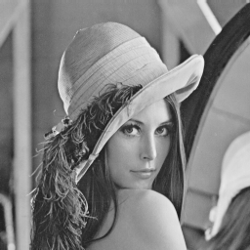
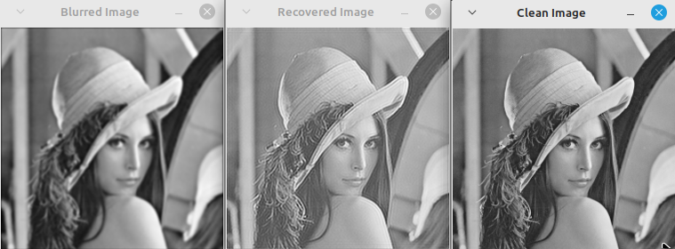
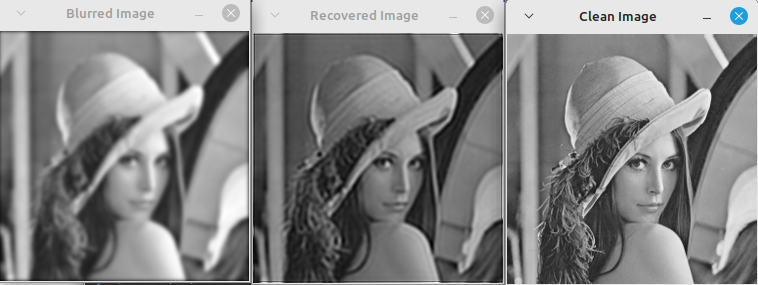

<script type="text/javascript" async
  src="https://cdn.jsdelivr.net/npm/mathjax@3/es5/tex-mml-chtml.js">
</script>

[Voltar para a página principal](../index.md)

# Universidade Federal do Rio Grande do Norte

# Projeto Final da Disciplina: Deconvolução de Imagens usando Otimização

**Engenharia Mecatrônica**  
**Disciplina: Processamento Digital de Imagens**

**Aluno(a):** Pedro Arthur Oliveira dos Santos  
**Professor(a):** Agostinho Brito Junior  
**Data:** 23/01/2025  

## Introdução

Neste projeto, abordamos a recuperação de uma imagem limpa $$F$$ a partir de uma imagem borrada $$B$$ e de uma máscara de borramento $$G$$ conhecida. Este é um problema típico de deconvolução no processamento de imagens, no qual o objetivo é reconstruir $$F$$ de forma precisa, minimizando artefatos e ruídos.
A deconvolução é um processo matemático que busca reverter o resultado de uma convolução, dado um sistema da forma

$$
Y = F \ast G
$$

procura-se obter um dos sinais $$F$$ ou $$G$$.
Quando apenas o sinal $$Y$$ é conhecido e queremos obter um dos sinais que foram convoluídos, dizemos que a deconvolução é cega, já quando temos a saída da convolução e um dos sinais $$F$$ ou $$G$$, e queremos obter o que falta, dizemos que a deconvolução é determinística, e é o caso que será tratado nesse projeto.


## Metodologia
O cenário abordado nesse projeto é um cenário onde capturamos uma imagem borrada e temos o modelo da máscara que fez o borramento da imagem, e queremos obter a imagem limpa a partir das outras duas, esse processo também é conhecido na literatura como desborramento ou "debluring" em inglês.


### Formulação do Problema

O problema de deconvolução é formulado como um problema de otimização que busca a minimização da seguinte função de custo:

$$
E(F(i,j))  =  \sum_{i,j} ( B(i,j) - (G \ast F)(i,j) )^2 = \sum_{i,j}  ( B(i,j) - \sum_{u} \sum_{v} F(u,v) G(i-u,j-v) )^2 + \lambda \nabla^2 F(i,j)
$$

que representa o erro médio quadrático entre os pixels da imagem borrada e da imagem modelada pela convolução com a máscara de borramento.

Onde:
- $$B(i,j)$$: Pixel da imagem borrada.
- $$G \ast F$$: Convolução da máscara $$G$$ com a imagem limpa $$F$$.
- $$\nabla^2 F(i,j)$$: Laplaciano do pixel $$F(i,j)$$.
- $$\lambda$$: Fator de regularização que controla o peso da suavização.

### Gradiente da Função de Custo

Calculando o gradiente da função custo em relação a cada pixel $$(x,y)$$, temos que

$$
\frac{\partial }{\partial F(x,y)} E(F(x,y)) = \frac{\partial }{\partial F(x,y)} \sum_{i,j} ( B(i,j) -  \sum_{u} \sum_{v} G(u,v) F(i-u,j-v) )^2 
$$

utilizando a regra da cadeia, temos

$$
\frac{\partial }{\partial F(x,y)} E( F(x,y) ) =  2 \cdot \sum_{i,j} ( B(i,j)  - \sum_{u} \sum_{v} G(u,v) F(i-u,j-v) )  \cdot 
\frac{\partial }{\partial F(x,y)} (- \sum_{u} \sum_{v} G(u,v) F(i-u,j-v) ) 
$$

e a derivada abaixo pode ser calculada quando $$i - u = x$$ e $$j - v = y$$.

$$
\frac{\partial }{\partial F(x,y)} (- \sum_{u} \sum_{v} G(i-x,j-y) F(x,y) ) = G(i -x, j - y)
$$

substituindo na derivada total, finalmente temos o gradiente em relação ao pixel $$(x,y)$$ da imagem a ser recuperada, e podemos usar um método de descida para achar a melhor solução computacionalmente.

$$
\frac{\partial }{\partial F(x,y)} E( F(x,y) ) =  -2 \cdot \sum_{i,j} [  ( B(i,j)  - \sum_{u} \sum_{v} G(u,v) F(i-u,j-v) ) \cdot G(i -x, j - y) ]
$$

e isso pode ainda ser escrito como a convolução do resultado da subtração pela máscara G espelhada, ou transposte,
e finalmente temos que o gradiente da função de custo em relação a imagem a ser recuperada $$F(i,j)$$ é dado por:

$$
\frac{\partial E}{\partial F} = 2 G^T \ast (G \ast F - B) - \lambda \nabla^2 F
$$

Onde $$G^T$$ é a máscara $$G$$ transposta ou refletida.


### Algoritmo de Otimização

1. **Inicialização**:
   - Definir $$F_0$$ como um chute inicial (por exemplo, a imagem borrada $$B$$ ou uma imagem aleatória).
     
2. **Iteração**:
   - Calcular o gradiente $$\frac{\partial E}{\partial F}$$.
   - Atualizar $$F$$ usando o método de descida do gradiente para minimizar a função objetivo:
     $$
     F^{(k+1)} = F^{(k)} - \eta \frac{\partial E}{\partial F^k}
     $$
     Onde $$\eta$$ é a taxa de aprendizado ou passo do gradiente.
     
3. **Convergência**:
   - Parar quando
    $$ ||F^{(k+1)} - F^{(k)}|| $$ for menor que um limiar predefinido
    ou quando um certo número de iterações $$n_{iteraçôes}$$ for atingoido.


### Regularização Laplaciana

A regularização Laplaciana é implementada aplicando um filtro Laplaciano 3x3 à imagem $$F$$, definido como:

$$
\text{Kernel Laplaciano} =
\begin{bmatrix}
0 & -1 & 0 \\
-1 & 4 & -1 \\
0 & -1 & 0
\end{bmatrix}
$$

e serve para buscar uma solução mais suave para o problema, em busca das bordas da imagem.

### Implementação
O algoritmo foi implementado em C++ usando a biblioteca OpenCV. A função principal realiza as seguintes etapas:
1. Carregar a imagem borrada $$B$$ e gera a máscara $$G$$ a partir das funções de gerar gaussianas do OpenCV.
2. Inicializar a imagem $$F$$ com $$B$$ como sendo o chute inicial.
3. Executar o loop de descida de gradiente até a convergência.

## Código C++

```cpp
#include <opencv2/opencv.hpp>
#include <iostream>

// Função para cálculo direto da convolução
cv::Mat convolve(const cv::Mat& image, const cv::Mat& kernel) {
    cv::Mat result;
    cv::filter2D(image, result, -1, kernel, cv::Point(-1, -1), 0, cv::BORDER_CONSTANT);
    return result;
}

// Função para calcular o Laplaciano da imagem
cv::Mat computeLaplacian(const cv::Mat& image) {
    cv::Mat laplacian;
    cv::Laplacian(image, laplacian, CV_32F, 1, 1, 0, cv::BORDER_CONSTANT);
    return laplacian;
}

// Função principal que faz a deconvolução da imagem e retorna a imagem estimada
cv::Mat deblurImage(const cv::Mat& blurred, const cv::Mat& kernel, float lambda, int iterations, float learning_rate) {
    // Inicialização da imagem a ser recuperada como a imagem borrada(chute inicial)
    cv::Mat clean = blurred.clone();

    //Conversão para float para fazer as operações matemáticas
    clean.convertTo(clean, CV_32F);
    
    // Espelhamento do Kernel 
    cv::Mat kernelFlipped;
    kernel.convertTo(kernel, CV_32F);
    cv::flip(kernel, kernelFlipped, -1);  // Inverte o kernel para a convolução inversa


    for (int iter = 0; iter < iterations; ++iter) {
        // Convolução de G * F
        cv::Mat blurredEstimate = convolve(clean, kernel);
        cv::normalize(blurredEstimate, blurredEstimate, 0, 255, cv::NORM_MINMAX);

        // Gradiente da função de erro
        cv::Mat grad = convolve(blurredEstimate - blurred, kernelFlipped);

        // Regularização Laplaciana
        cv::Mat laplacian = computeLaplacian(clean);

        // Atualize a imagem limpa
        clean -= learning_rate * (grad + lambda * laplacian);
    }

    // Converta a imagem de volta para o formato original para exibição
    clean.convertTo(clean, blurred.type());
    cv::normalize(clean,clean,0,255,cv::NORM_MINMAX);
    return clean;
}

int main() {
    // Carregar a imagem limpa (em tons de cinza)
    cv::Mat clean = cv::imread("lena.png", cv::IMREAD_GRAYSCALE);
    if (clean.empty()) {
        std::cerr << "Erro ao carregar a imagem limpa!" << std::endl;
        return -1;
    }

    clean.convertTo(clean, CV_32F);

    // Criar a máscara (kernel de borramento) - pode ser personalizada
    int kernelSize = 5;  //Tamanho do borramento
    cv::Mat mask = cv::getGaussianKernel(kernelSize, -1, CV_32F) *
                     cv::getGaussianKernel(kernelSize, -1, CV_32F).t();


    // Aplicar o borramento sintético
    cv::Mat blurred = convolve(clean, mask);
    cv::normalize(blurred, blurred, 0, 255, cv::NORM_MINMAX);

    // Parâmetros do algoritmo
    float lambda = 0.01;          // Fator de regularização
    int iterations = 700;        // Número de iterações
    float learning_rate = 0.1f;  // Taxa de aprendizado ou passo do gradiente

    // Recuperar a imagem limpa a partir da imagem borrada utilizando a deconvolução
    cv::Mat recovered = deblurImage(blurred, mask, lambda, iterations, learning_rate);
    

    // Convertendo para uchar para exibir    
    recovered.convertTo(recovered,CV_8U);
    clean.convertTo(clean, CV_8U);
    blurred.convertTo(blurred, CV_8U);  // Convertendo para tipo adequado para exibição

    // Salvar e exibir as imagens
    cv::imwrite("recovered_image.jpg", recovered);
    cv::imshow("Clean Image", clean);
    cv::imshow("Blurred Image", blurred);
    cv::imshow("Recovered Image", recovered);
    cv::waitKey(0);

    return 0;
}


```

## Resultados e discussões
Aplicando a deconvolução a imagem da lena mostrada abaixo, com um borramento de uma máscara gaussiana de fórmula

$$
G(x,y) = e^{-\frac{x^2 + y²}{2 \sigma ²}}
$$

onde $$x = {-2,-1,0,1,2}$$ e $$y = {-2,-1,0,1,2}$$ no caso de $$N = 5$$, pela imagem limpa.




*Figura 1: Imagem a ser borrada pelo filtro gaussiano.*

Foi aplicada a deconvolução com os seguintes parâmetros

$$
\begin{bmatrix}
\lambda = 0.01 \\
n_{iterações} = 700\\
\eta = 0.1
\end{bmatrix}
$$

observou-se que a imagem recuperada ficou muito próxima da imagem limpa, a não ser por um ganho nos tons de cinza, como é possível ver abaixo



*Figura 2: Comparação da Imagem recuperada pela deconvolução com $$N = 5$$.*


Porém ao aumentar a intensidade do borramento, fica cada vez mais difícil conseguir recuperar a imagem
com um borramento de $$N = 11$$, a recuperação ja ficou bem prejudicada e surgira, componentes de alta frequência devido a regularização laplaciana.
A solução para isso pode ser encontrada usando outra função de custo para os pixels da imagem, e talvez algum fator de restrição/regularização mais robusto para o problema ficar melhor posto e ter uma solução mais "limpa" em vez de suave.

A figura abaixo mostra o resultado para um borramento de $$N = 11$$




*Figura 3: Imagem da lena recuperada de um borramento $$N = 11$$.*


## Referências
[1] GONZALEZ, Rafael C.; WOODS, Richard E. Processamento Digital de Imagens. Pearson Prentice Hall, 2008.
OpenCV Documentation: https://docs.opencv.org/

[2] FERREIRA, L. V.; KASZKUREWICZ, E.; BHAYA, A. Image Restoration Using L1-Norm Regularization and a Gradient-Based Neural Network with Discontinuous Activation Functions. Título do Periódico ou Evento (se houver), Local, Volume, Páginas, Ano.

