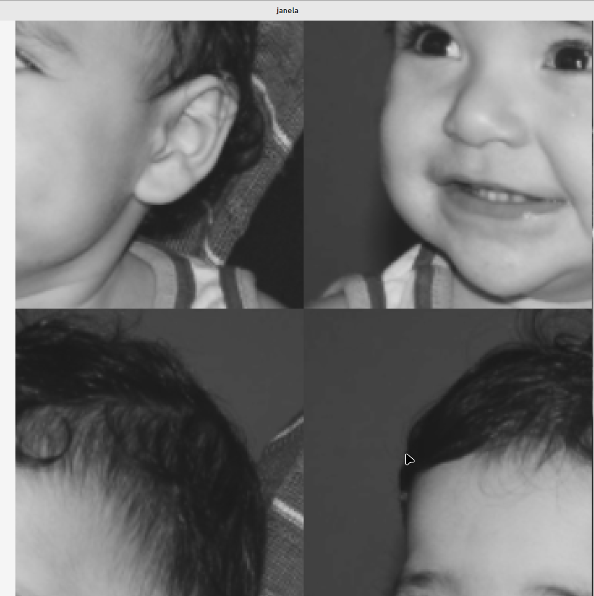

<script type="text/javascript" async
  src="https://cdn.jsdelivr.net/npm/mathjax@3/es5/tex-mml-chtml.js">
</script>

[Voltar para a página principal](../index.md)


# Universidade Federal do Rio Grande do Norte

#**Relatório Atividade 1: Negativo e Inversão de Quadrantes**

**Engenharia Mecatrônica**  
**Disciplina: Processamento Digital de Imagens**

**Aluno(a):** Pedro Arthur Oliveira dos Santos  
**Professor(a):** Agostinho Brito Junior  
**Data:** 25/10

## 1. Introdução

No campo do processamento digital de imagens, a operação de negativo de uma imagem é uma das transformações mais simples e amplamente utilizadas para realçar certas características visuais. O negativo de uma imagem consiste em uma operação que altera os valores de intensidade de cada pixel, invertendo suas cores. Em uma imagem em escala de cinza, isso significa substituir o valor de intensidade de cada pixel por seu complementar na escala de 0 a 255, de forma que áreas claras se tornam escuras e áreas escuras se tornam claras.
Outra operação que pode ser feita com imagem é a troca das posições espaciais dos seus pixels.

O objetivo deste relatório é apresentar a implementação da operação de negativo aplicada a uma imagem digital e discutir seus efeitos visuais, além de abordar a inversão de quadrantes da imagem como uma forma adicional de manipulação.

---

## 2. Objetivo

O objetivo deste experimento é implementar e analisar a operação de negativo de uma imagem, além de realizar a inversão de quadrantes, observando os efeitos resultantes dessas transformações.

---

## 3. Metodologia

### Operação de negativo
A operação de negativo de uma imagem foi realizada utilizando o código escrito em [linguagem utilizada, ex.: Python]. A fórmula matemática utilizada para realizar o negativo de uma imagem em escala de cinza é expressa por:

$$
g(x, y) = 255 - f(x, y)
$$

Onde:
- $$f(x, y)$$  representa o valor de intensidade de cinza do pixel na posição $$(x, y)$$ da imagem original,
- $$g(x, y)$$ é o valor correspondente do pixel na imagem negativa,
- $$255$$ é o valor máximo de intensidade em uma imagem de 8 bits, o que permite obter o complemento do valor de intensidade original.

A operação foi aplicada pixel a pixel, modificando cada ponto da imagem de acordo com a equação acima.

### Operação de Inversão de quadrantes
Além da operação de negativo, foi implementada a técnica de inversão de quadrantes. Esta operação consiste em dividir a imagem em quatro quadrantes e trocar suas posições, de modo a reordenar visualmente a disposição dos pixels.
A equação matemática da inversão de quadrantes é simplesmente a troca das posições dos pixels de uma certa região por outra.
Temos que m é o número de linhas da imagem(eixo x) e n o número de colunas(eixo y), temos então que para uma nova imagem $$g(x,y)$$ :

* Primeiro quadrante 

$$
g(x,y) = f(x+m/2,y+m/2)  
$$

* Segundo quadrante

$$
g(x,y+m/2) = f(x+m/2,y)  
$$

* Terceiro quadrante

$$
g(x+m,y) = f(x,y+m/2)  
$$

* Quarto quadrante

$$
g(x+m/2,y+m/2) = f(x,y)  
$$

e conseguimos fazer isso tudo apenas em um laço.


### 3.1. Implementação
As funções foram feitas usando uma classe ponto para facilitar a entrada e a manipulação dos pixels.
As funções implementadas estão mostradas abaixo:
* Código da operação de negativo
  
```

#include <iostream>
#include <opencv2/opencv.hpp>

//Classe ponto para facilitar a manipulação
class point
{

private:
  double x;
  double y;
  
public:
  point(double x_1, double y_1);
  point();

  // Métodos para acessar os valores
  double getX() const;
  double getY() const;

  
};


point::point(double x_1, double y_1): x(x_1), y(y_1){}
point::point(): x(0.0), y(0.0){}

double point::getX() const{
    return x;
}

double point::getY() const{
    return y;
}

//Função que implementa a operação de negativo
cv::Mat negative(point P1, point P2, cv::Mat imagem){
    double x1;
    double x2;
    double y1;
    double y2;
    cv::Mat image = imagem.clone();
    //Comparação pra ver qual é o ponto da "esquerda"
    if (P1.getX()>P2.getX()){
        x1 = P2.getX();
        x2 = P1.getX();
        if(P1.getY()>P2.getY()){
            y1 = P2.getY();
            y2 = P1.getY();
        }
        else{
            y1 = P1.getY();
            y2 = P2.getY();
        }
    }
    else{
        x1 = P1.getX();
        x2 = P2.getX(); 
        if(P1.getY()>P2.getY()){
            y1 = P2.getY();
            y2 = P1.getY();
        }
        else{
            y1 = P1.getY();
            y2 = P2.getY();
        }
    }

    //Implementação da operação de negativo
    for (int i = x1; i <x2 ; i++) {
        for (int j = y1 ; j < y2; j++) {
            image.at<uchar>(i, j) = 255 - image.at<uchar>(i,j) ;

        }
    }

    return image;

}


int main(int, char**) {
  cv::Mat image;
  cv::Vec3b val;

  image = cv::imread("biel.png", cv::IMREAD_GRAYSCALE);
  if (!image.data) std::cout << "nao abriu biel.png" << std::endl;

  cv::namedWindow("janela", cv::WINDOW_NORMAL);
  
  double x1;
  double y1;
  double x2;
  double y2;

  std::cout<<"Digite as coordenadas do ponto P1"<<std::endl;
  std::cin>>x1>>y1;
  std::cout<<"Digite as coordenadas do ponto P2"<<std::endl;
  std::cin>>x2>>y2;

  point P1(x1,y1);
  point P2(x2,y2); 
  cv::Mat imagem = negative(P1,P2,image);

  cv::imshow("janela", imagem);
  cv::waitKey();
  return 0;
}

```


* Código da operação de inversão de quadrantes

```

#include <iostream>
#include <opencv2/opencv.hpp>


//Função que realiza a troca de quadrantes
cv::Mat troca_regioes(cv::Mat imagem){

    cv::Mat imagem_nova = imagem.clone();
    int n = imagem_nova.rows/2;
    int m = imagem_nova.cols/2;

    //Troca de quadrantes em um único laço
    for(int i = 0;i<n;i++) {
      for(int j = 0;j<m;j++) {
        imagem_nova.at<uchar>(i,j) = imagem.at<uchar>(n+i,j+m);
        imagem_nova.at<uchar>(i+n,j+m) = imagem.at<uchar>(i,j);
        imagem_nova.at<uchar>(i,j+m) = imagem.at<uchar>(i+n,j);
        imagem_nova.at<uchar>(i+n,j) = imagem.at<uchar>(i,j+m);
      }

    }

    return imagem_nova;

}


int main(int, char**) {
  cv::Mat image;

  image = cv::imread("biel.png", cv::IMREAD_GRAYSCALE);
  if (!image.data) std::cout << "nao abriu biel.png" << std::endl;

  cv::namedWindow("janela", cv::WINDOW_NORMAL);

  cv::Mat imagem_trocada = troca_regioes(image);
  cv::imshow("janela", imagem_trocada);
  cv::waitKey();
  return 0;
}

```

## 4. Resultados

### Operação de negativo
A operação de negativo produz um efeito visual interessante, onde as áreas mais escuras da imagem original tornam-se claras e vice-versa. Isso permite uma nova percepção da cena, podendo realçar detalhes que não são tão evidentes na imagem original.

Na imagem original, as áreas com maiores valores de $f(x, y)$ são transformadas em áreas de menor valor de $g(x, y)$, o que resulta em um efeito de contraste invertido. O efeito garante que o valor de intensidade de cinza de cada pixel seja subtraído de 255, criando essa inversão.


### Operação de inversão de quadrantes
A inversão dos quadrantes introduziu uma distorção espacial na imagem, onde as partes da imagem foram reorganizadas, criando um novo padrão visual que pode ser útil para efeitos artísticos ou análises de simetria.




---

## 5. Conclusão

A operação de negativo de uma imagem é uma técnica simples, mas eficaz, para a manipulação de imagens digitais. Ao substituir cada valor de intensidade de pixel pelo seu complemento, conseguimos inverter o contraste da imagem, o que pode ser útil em diversas aplicações, como em processamento médico, onde inversões de contraste podem revelar detalhes ocultos.

A inversão dos quadrantes, por sua vez, altera a disposição espacial dos pixels, criando uma nova organização visual da imagem. Essas técnicas juntas demonstram como manipulações básicas no processamento de imagens podem resultar em efeitos visuais significativos e úteis.

---

## 6. Referências

GONZALEZ, Rafael C.; WOODS, Richard E. **Processamento Digital de Imagens**. 3. ed. São Paulo: Pearson Prentice Hall, 2010.
