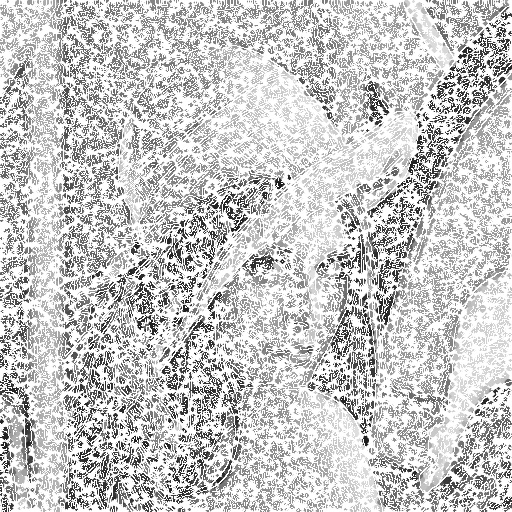

<script type="text/javascript" async
  src="https://cdn.jsdelivr.net/npm/mathjax@3/es5/tex-mml-chtml.js">
</script>

[Voltar para a página principal](../index.md)

#**Relatório Atividade 9: Arte com Processamento digital de imagens: Quantização Vetorial e separação**

# Universidade Federal do Rio Grande do Norte

**Engenharia Mecatrônica**  
**Disciplina: Processamento Digital de Imagens**

**Aluno(a):** Pedro Arthur Oliveira dos Santos  
**Professor(a):** Agostinho Brito Junior  
**Data:** 12/12/2024

## 1. Introdução

Hoje em dia problemas de classificação são cada vez mais comuns de se ver, e desde o início do surgimento do aprendizado de maquina, muitos algoritmos
se popularizaram.
No processamento digital de imagens, também há a necessidade da separação de elementos em uma imagem, que seguem uma classificação, por exemplo objetos
de uma certa cor, ou de um certo formato, ainda.

---

## 2. Objetivo

O Objetivo dessa atividade é utilizar o algorítmo de quantização vetorial k-means para separar as cores de uma imagem, e assim verificar se o processo de classificação
utilizando esse algorítmo consegue separar bem as classes.

---


## 3. Metodologia

### Algorítmo de quantização vetorial


### 3.1. Implementação da técnica
Foi então utilizado o código do professor como referência para a extração das bordas com o algorítmo de canny e também para a implementação da técnica pontilhista, e finalmente feito a adaptação para a técnica descrita acima, que utiliza números aleatórios e as bordas para deixar a imagem com um efeito visual de borda forte.

* Código

```

```


## 4. Resultados

### Resultado da implementação da técnica de arte
Podemos ver que ao somar a borda a imagem continuamente, criou-se um efeito visual de borda forte e um expressionismo na imagem, causando
uma certa sensação estranha.




*Figura 1: Resultado da técnica desenvolvida.*

---

## 5. Conclusão

Vimos que a técnica desenvolvida, apesar de estranha a priori, produziu um efeito curioso, como muitas técnicas de arte, que tem o poder de encantar nosso cérebro e
nos dar uma percepção da beleza das coisas.

---

## 6. Referências

GONZALEZ, Rafael C.; WOODS, Richard E. **Processamento Digital de Imagens**. 3. ed. São Paulo: Pearson Prentice Hall, 2010.
