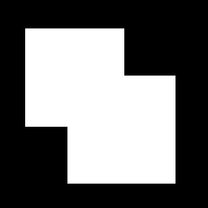
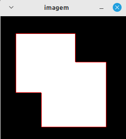

<script type="text/javascript" async
  src="https://cdn.jsdelivr.net/npm/mathjax@3/es5/tex-mml-chtml.js">
</script>

[Voltar para a página principal](../index.md)

#**Relatório Atividade 12: Extração de contornos**

# Universidade Federal do Rio Grande do Norte

**Engenharia Mecatrônica**  
**Disciplina: Processamento Digital de Imagens**

**Aluno(a):** Pedro Arthur Oliveira dos Santos  
**Professor(a):** Agostinho Brito Junior  
**Data:** 10/01/2025

## 1. Introdução

A extração de contornos é necessária em diversas aplicações do dia a dia e pode ser muito útil, existem vários algorítmos para extração de contornos, alguns mais custosos e outros não.
O algorítmo utilizado nesse relatório será um dos algorítmos prontos ja implementados no opencv, para achar os contornos de uma imagem binária.

---

## 2. Objetivo

O Objetivo dessa atividade é utilizar o algorítmo de extração de contornos para marcar os contornos de várias figuras em uma imagem binária, e assim verificar a eficiẽncia do algorítmo.

---


## 3. Metodologia

###  3.1. Algorítmo de extração de contornos
Aplicamos diretamente o algorítmo "Find_contours" fornecido pelo OPENCV, dado abaixo


* Código

```

#include <fstream>
#include <iostream>
#include <opencv2/opencv.hpp>

int main(int argc, char** argv) {
  cv::Mat image, gray;
  std::ofstream file;

  image = cv::imread(argv[1], cv::IMREAD_GRAYSCALE);

  if (!image.data) {
    std::cout << "nao abriu " << argv[1] << std::endl;
    return 0;
  }

  cv::threshold(image, image, 1, 255, cv::THRESH_BINARY + cv::THRESH_OTSU);

  std::vector<std::vector<cv::Point> > contours;
  std::vector<cv::Vec4i> hierarchy;

  cv::findContours(image, contours, hierarchy, cv::RETR_EXTERNAL,
                   cv::CHAIN_APPROX_NONE);

  //cv::findContours(image, contours, hierarchy, cv::RETR_EXTERNAL,
    //               cv::CHAIN_APPROX_SIMPLE);

  cv::cvtColor(image, image, cv::COLOR_GRAY2BGR);

  file.open("contornos.svg");
  if (!file.is_open()) {
    std::cout << "nao abriu contornos.svg" << std::endl;
    return 0;
  }

  file << "<svg height=\"" << image.rows << "\" width=\"" << image.cols
       << "\" xmlns=\"http://www.w3.org/2000/svg\"> " << std::endl;

  for (size_t i = 0; i < contours.size(); i++) {
    file << "<path d=\"M " << contours[i][0].x << " " << contours[i][0].y
         << " ";
    for (size_t j = 1; j < contours[i].size(); j++) {
      file << "L" << contours[i][j].x << " " << contours[i][j].y << " ";
    }
    file << "Z\" fill=\"#cccccc\" stroke=\"black\" stroke-width=\"1\" />"
         << std::endl;
    cv::drawContours(image, contours, i, CV_RGB(255, 0, 0));
  }
  file << "</svg>" << std::endl;

  cv::imshow("imagem", image);
  cv::waitKey();
  return 0;
}

```




*Figura 1: Imagem em que foi aplicada a extração de contornos.*


## 4. Resultados

### Resultado utilizando cv::CHAIN_APPROX_NONE
Foi obtido um contorno com 746 pontos pontos para essa abordagem.


*Figura 2: Imagem do contorno resultante pela primeira abordagem.*


### Resultado utilizando cv::CHAIN_APPROX_SIMPLE
Ja utilizando essa abordagem, foi obtido um contorno com 10 pontos nessa segunda abordagem.




*Figura 3: Imagem do contorno resultante pela segunda abordagem.*


Com a primeira abordagem é fácil perceber que o algorítmo armazena todos os pontos da borda, ja com a segunda abordagem os pontos são filtrados e só sobram os essenciais, que nesse caso são os vértices do retângulo e pontos auxiliares, melhorando a eficiência de armazenamento pro algorítmo.

---

## 5. Conclusão

Vemos que o algorítmo de extração de contornos não da o melhor resultado sempre, as vezes é preciso mudar alguns parâmetros, por exemplo a disposição da cadeia de pontos, como foi visto acima, para obter um resultado mais otimizado dependedo do tipo de imagem. 

---

## 6. Referências

GONZALEZ, Rafael C.; WOODS, Richard E. **Processamento Digital de Imagens**. 3. ed. São Paulo: Pearson Prentice Hall, 2010.
