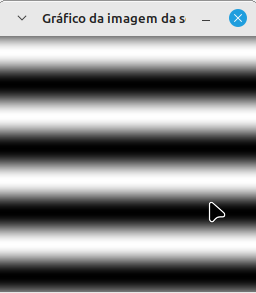

<script type="text/javascript" async
  src="https://cdn.jsdelivr.net/npm/mathjax@3/es5/tex-mml-chtml.js">
</script>

[Voltar para a página principal](../index.md)

# ** Relatório Atividade 4: Preenchendo Regiões **

# Universidade Federal do Rio Grande do Norte

**Engenharia Mecatrônica**  
**Disciplina: Processamento Digital de Imagens**

**Aluno(a):** Pedro Arthur Oliveira dos Santos  
**Professor(a):** Agostinho Brito Junior  
**Data:** 25/10

## 1. Introdução

No campo do processamento digital de imagens, existem vários algorítmos que exploram o conceito de vizinhança dos pixels de uma imagem, os mais conhecidos são os algoritmos do tipo floodFill ou seedFill, que são usados para percorrer a vizinhança de uma imagem a partir de um critério.
A utilidade desses algoritmos é variada porém são muito usados para achar certos objetos, certas regiões e até certas cores em alguma imagem, como nesta atividade.

---

## 2. Objetivo

O Objetivo dessa atividade é explorar o uso do algoritmo floodFill para uma situação bem específica de achar objetos em uma iamagem binária e classificá-los usando o algorítmo labeling, e assim adaptar o algoritmo fornecido pelo professor para achar objetos com buracos ou não, e que estão fora da borda.


---

## 3. Metodologia
Para primeiro exclir os objetos das bordas, foi realizado um floodFill prévio na imagem que classificou e eliminou(pintando de preto) os objetos brancos que tocavam a borda, para só depois executar o floodFill para achar os objetos que tinham buracos e também os que não tinham.
Para conseguir achar os objetos que tinham buracos, para cada objeto achado, é executado um segundo for para achar os buracos dentro desse objeto, ou seja, detectar uma mudança de branco para preto dentro do objeto.

---
### 3.1. Implementação
Foi então implementado a adapatação do algoritmo
* Código

```


```


## 4. Resultados

### Exercício 1: Observando-se o programa labeling.cpp como exemplo, é possível verificar que caso existam mais de 255 objetos na cena, o processo de rotulação poderá ficar comprometido, visto que o tipo de dado usado para suportar imagens cinzentas permitem armazenar apenas um byte por pixel. Identifique a situação em que isso ocorre e proponha uma solução para este problema.

Caso a imagem tenha mais de 255 objetos a serem classificados, não será mais possível classificá-los a partir do tom de cinza incrementado a partir do zero, ja que existem apenas 255 tons de cinza possíveis, então a solução seria classificar os objetos não a partir do tom de cinza mas sim a partir de um número, por exemplo seria possível desenhar um número de um certo tamanho no centro da imagem, porém seria um algoritmo um pouco mais 
trabalhoso de implementar

### Exercício 2:
Aprimore o algoritmo de contagem apresentado para identificar regiões com ou sem buracos internos que existam na cena. Assuma que objetos com mais de um buraco podem existir. Inclua suporte no seu algoritmo para não contar bolhas que tocam as bordas da imagem. Não se pode presumir, a priori, que elas tenham buracos ou não.

Os resultado foram satisfeito, ja que foram achados exatamente x objetos com buracos e y objetos sem buracos, que são exatamente o que existem na imagem.



---

## 5. Conclusão

A detecção de objetos em uma imagem é uma aplicação importantíssima na industria de todas as engenharias, podendo ser muito útil e ter algoritmos adaptados para cada situação, e dessa maneira a exploração desses algorítmos são importantíssimos em uma disciplina de processamento digital de imagens.

---

## 6. Referências

GONZALEZ, Rafael C.; WOODS, Richard E. **Processamento Digital de Imagens**. 3. ed. São Paulo: Pearson Prentice Hall, 2010.
