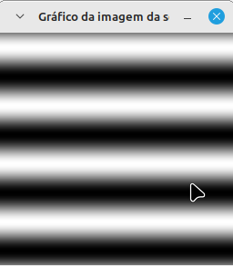

<script type="text/javascript" async
  src="https://cdn.jsdelivr.net/npm/mathjax@3/es5/tex-mml-chtml.js">
</script>

[Voltar para a página principal](../index.md)

# **Relatório Atividade 5: Manipulação de histograma **

# Universidade Federal do Rio Grande do Norte

**Engenharia Mecatrônica**  
**Disciplina: Processamento Digital de Imagens**

**Aluno(a):** Pedro Arthur Oliveira dos Santos  
**Professor(a):** Agostinho Brito Junior  
**Data:** 05/11

## 1. Introdução

A manipulação de histogramas é uma das ferramentas fundamentais que são aprendidas na disciplina de processamento digital de imagens, e pode ser usada para vários fins
como detecção de movimento, e operações sobre a própria imagem.

---

## 2. Objetivo

O Objetivo dessa atividade é explorar a manipulação de histogramas para detecção de movimento e para a aplicação da técnica de equalização de histograma para melhorar a visualização e contraste da imagem.

---

## 3. Metodologia

### Exercício 1:
Equalização de histograma
A operação de equalização de histograma usa conceitos de uma distribuição de probabilidade cumulativa para melhorar a distribuição dos tons de cinza
e melhorar o contraste da imagem, e isso é implementado usando uma soma acumulada.
Sendo assim, o j-ésimo termo do vetor de histograma equalizado é dado por

$$
h_{eq}[j] = \sum_{i = 0}^{j} h[j]
$$


### Exercício 2: 
Detector de movimento
O detector de movimento pode ser implementado verificando a diferença entre as imagens sucessivas capturadas pela câmera, e assim ativar um alarme.


---
### 3.1. Implementação
### Exercício 1: 
A equalização de histograma pode ser implementada pela função ``` equalizeHist ``` do opencv, que recebe como parâmetro o histograma atual, e uma matriz que irá receber o histograma acumulado.

* Código da equalização de histograma

```
#include <iostream>
#include <opencv2/opencv.hpp>
#include "camera.hpp"

int main(int argc, char** argv) {
  cv::Mat image, grayImage, equalizedImage;
  int width, height;
  int camera;
  cv::VideoCapture cap;

  // Iniciar a captura de vídeo
  camera = cameraEnumerator();
  cap.open(camera);

  if (!cap.isOpened()) {
    std::cout << "Câmera indisponível" << std::endl;
    return -1;
  }

  // Configurar a resolução da câmera
  cap.set(cv::CAP_PROP_FRAME_WIDTH, 640);
  cap.set(cv::CAP_PROP_FRAME_HEIGHT, 480);
  width = cap.get(cv::CAP_PROP_FRAME_WIDTH);
  height = cap.get(cv::CAP_PROP_FRAME_HEIGHT);

  std::cout << "Largura = " << width << std::endl;
  std::cout << "Altura  = " << height << std::endl;

  int key;
  while (1) {
    // Capturar a imagem
    cap >> image;
    if (image.empty()) {
      std::cout << "Erro ao capturar a imagem" << std::endl;
      break;
    }

    // Converter a imagem para tons de cinza
    cv::cvtColor(image, grayImage, cv::COLOR_BGR2GRAY);

    // Equalizar o histograma da imagem em tons de cinza
    cv::equalizeHist(grayImage, equalizedImage);

    // Exibir a imagem equalizada
    cv::imshow("Imagem Equalizada", equalizedImage);

    // Pressionar ESC para sair
    key = cv::waitKey(30);
    if (key == 27) break;
  }

  return 0;
}


```

* Código do detector de movimento

```
#include <iostream>
#include <opencv2/opencv.hpp>
#include "camera.hpp"

int main(int argc, char** argv) {
  cv::Mat frame, grayFrame;
  cv::Mat histCurrent, histPrevious;
  int camera;
  cv::VideoCapture cap;
  int nbins = 64;
  float range[] = {0, 255};
  const float* histRange = { range };
  bool uniform = true;
  bool accumulate = false;

  double threshold = 50.0; // Limiar de diferença acumulada para detectar movimento (ajuste conforme necessário)
  
  // Iniciar captura de vídeo
  camera = cameraEnumerator();
  cap.open(camera);

  if (!cap.isOpened()) {
    std::cout << "Câmera indisponível" << std::endl;
    return -1;
  }

  // Configurar resolução da câmera
  cap.set(cv::CAP_PROP_FRAME_WIDTH, 640);
  cap.set(cv::CAP_PROP_FRAME_HEIGHT, 480);

  int key;

  // Capturar o primeiro quadro para inicializar o histograma anterior
  cap >> frame;
  if (frame.empty()) {
    std::cout << "Erro ao capturar a imagem" << std::endl;
    return -1;
  }

  // Converter o quadro inicial para tons de cinza
  cv::cvtColor(frame, grayFrame, cv::COLOR_BGR2GRAY);

  // Calcular o histograma inicial (histograma anterior)
  cv::calcHist(&grayFrame, 1, 0, cv::Mat(), histPrevious, 1, &nbins, &histRange, uniform, accumulate);
  cv::normalize(histPrevious, histPrevious, 0, 1, cv::NORM_MINMAX);

  while (1) {
    // Capturar o próximo quadro
    cap >> frame;
    if (frame.empty()) {
      std::cout << "Erro ao capturar a imagem" << std::endl;
      break;
    }

    // Converter para tons de cinza
    cv::cvtColor(frame, grayFrame, cv::COLOR_BGR2GRAY);

    // Calcular o histograma atual
    cv::calcHist(&grayFrame, 1, 0, cv::Mat(), histCurrent, 1, &nbins, &histRange, uniform, accumulate);
    cv::normalize(histCurrent, histCurrent, 0, 1, cv::NORM_MINMAX);

    // Calcular a diferença manualmente entre os bins dos histogramas
    double totalDifference = 0.0;
    for (int i = 0; i < nbins; i++) {
      float binCurrent = histCurrent.at<float>(i);
      float binPrevious = histPrevious.at<float>(i);
      totalDifference += std::abs(binCurrent - binPrevious);
    }

    // Verificar se a diferença total ultrapassa o limiar
    if (totalDifference > threshold) {
      std::cout << "Movimento detectado!" << std::endl;
      cv::putText(frame, "Movimento Detectado!", cv::Point(50, 50),
                  cv::FONT_HERSHEY_SIMPLEX, 1, cv::Scalar(0, 0, 255), 2);
    }

    // Exibir o quadro
    cv::imshow("Detector de Movimento", frame);

    // Atualizar o histograma anterior para a próxima iteração
    histPrevious = histCurrent.clone();

    // Pressionar ESC para sair
    key = cv::waitKey(30);
    if (key == 27) break;
  }

  return 0;
}


```


## 4. Resultados




---

## 5. Conclusão

A detecção de objetos em uma imagem é uma aplicação importantíssima na industria de todas as engenharias, podendo ser muito útil e ter algoritmos adaptados para cada situação, e dessa maneira a exploração desses algorítmos são importantíssimos em uma disciplina de processamento digital de imagens.

---

## 6. Referências

GONZALEZ, Rafael C.; WOODS, Richard E. **Processamento Digital de Imagens**. 3. ed. São Paulo: Pearson Prentice Hall, 2010.
