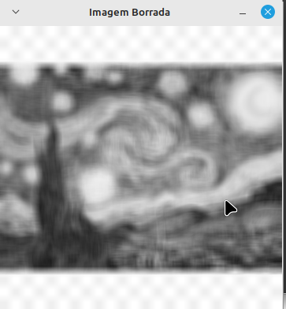
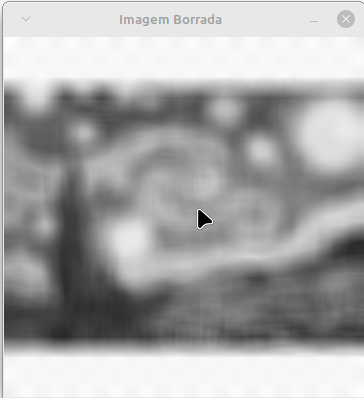
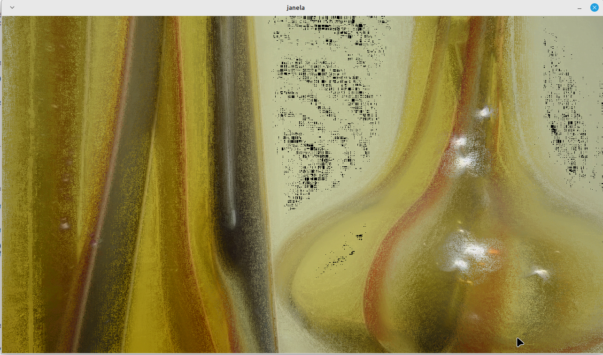

<script type="text/javascript" async
  src="https://cdn.jsdelivr.net/npm/mathjax@3/es5/tex-mml-chtml.js">
</script>

[Voltar para a página principal](../index.md)

#** Relatório Atividade 6: Filtragem no domínio espacial **

# Universidade Federal do Rio Grande do Norte

**Engenharia Mecatrônica**  
**Disciplina: Processamento Digital de Imagens**

**Aluno(a):** Pedro Arthur Oliveira dos Santos  
**Professor(a):** Agostinho Brito Junior  
**Data:** 4/11

## 1. Introdução

Uma das operações mais importantes ao se trabalhar com imagens bidimensionais é a convolução bidimensional, que tem inúmeras aplicações no campo do processamento digital de imagens, principalmente o de realizar uma filtragem, borramento ou detecção de bordas.

---

## 2. Objetivo

O Objetivo dessa atividade é explorar o uso da operação de convolução de uma imagem com "máscaras" de convolução predefinidas especiais que ja foram estudadas, e assim entender melhor como isso pode ser útil no processamento digital de imagens, serão explorados o uso do filtro de média para realizar borramento de uma imagem, e do filtro laplaciano para realçar as características de uma imagem.

---

## 3. Metodologia

### Exercício 1:
Utilizando o programa exemplos/convolucao.cpp como referência, implemente um programa convolucao2.cpp. O programa deverá realizar a convolução com o filtro da média para máscaras de tamanho 11×11
e 21×21 pixels. Compare os resultados obtidos com o filtro de tamanho 3×3 pixels.

Foi adaptado o código ```convolução.cpp``` fornecido pelo professor na pagina da disciplina para fazer o borramento com um filtro de tamanho 11x11 e 21x21.

### Exercício 2: 
Observe o efeito presente no vídeo Exemplo do efeito de produndidade de campo (arquivo vasos720p.mp4). Este efeito é conhecido como profundidade de campo. Ele ocorre porque o conjunto de lentes não permite, para a abertura do diafragma, que todos os objetos em diferentes distâncias do plano focal sejam focados simultaneamente. Há situações em que explorar a profundidade de campo é interessante, como em retratos, para deixar o fundo da cena desfocado. Em outros casos, como em imagens de microscopia, pode não ser possível ajustar as objetivas do microscópio para deixar todos os elementos da cena focados, dificultando a análise completa do objeto em estudo.

Entretanto, é possível oferecer alguma correção para o efeito de profundidade de campo em imagens digitais tomadas de uma cena sem movimento, como esta do vídeo apresentado. Utilizando o programa exemplos/convolucao.cpp como referência, implemente um programa depthoffield.cpp que funcione conforme os seguintes passos:

Capture um frame da cena do vídeo.

Converta o frame para tons de cinza.

Crie uma matriz para guardar os máximos dos laplacianos que serão calculados a seguir.

Aplique um filtro laplaciano de tamanho 3×3
 pixels na imagem cinzenta.

Compare o resultado do filtro com a matriz de máximos e selecione aqueles que possuem um valor maior que o correspondente na matriz de máximos. Para os pixels selecionados, copie para a imagem de saída os pixels coloridos da imagem capturada.

Podemos primeiro converter a imagem para tons de cinza a fim de calcular o seu laplaciano, e depois verificar os pontos onde o laplaciano é máximo e armezenar o valor da função nesse ponto, para cada frame do vídeo.

---
### 3.1. Implementação

### Exercício 1:
Primeiramente foi criada uma máscara genérica NxN utilizando a função ```  ``` do opencv, e depois foi implementado uma melhoria para melhor iteratividade do usuário.
A máscara de média de tamanho $$N$$ genérico pode ser escrita como

$$
M = 
\frac{1}{N²} \cdot 
\begin{bmatrix}

1 & 1 & \cdots & 1 \\
1 & 1 & \cdots & 1 \\
\vdots & \vdots & \ddots & \vdots \\
1 & 1 & \cdots & 1 \\

\end{bmatrix}_{N \times N}
$$


e o borramento é proporcional ao valor de N.


* Código Iterativo para alterar a dimensão da máscara com as setas ``` up ```  e ``` down ```.

```
#include <iostream>
#include <opencv2/opencv.hpp>

int main() {
    cv::Mat image, image_32F, imagem_borrada;

    // Carrega a imagem em escala de cinza
    image = cv::imread("image.png", cv::IMREAD_GRAYSCALE);
    if (image.empty()) {
        std::cerr << "Erro ao carregar a imagem!" << std::endl;
        return -1;
    }

    image.convertTo(image_32F, CV_32F);
    int N = 3;  // Valor inicial da máscara (3x3)

    while (true) {
        int meio = (N - 1) / 2;

        // Cria uma máscara NxN com valores iguais e aplica o filtro
        cv::Mat mask = cv::Mat::ones(N, N, CV_32F) / (float)(N * N);
        cv::filter2D(image_32F, imagem_borrada, image_32F.depth(), mask, cv::Point(meio, meio), cv::BORDER_REPLICATE);

        // Converte para 8 bits para exibição
        cv::Mat imagem_borrada_8U;
        imagem_borrada.convertTo(imagem_borrada_8U, CV_8U);

        // Exibe o resultado
        cv::imshow("Imagem Borrada", imagem_borrada_8U);

        // Exibe o valor atual de N
        std::cout << "Dimensão da máscara: " << N << "x" << N << std::endl;

        // Espera por uma tecla
        int key = cv::waitKey();

        // Aumenta o tamanho da máscara ao pressionar a tecla "Seta para cima" e decrementa com "Seta para baixo"
        if (key == 27) // ESC para sair
            break;
        else if (key == 82) // Tecla "Seta para cima" (código 82)
            N += 2; // Aumenta N para o próximo ímpar
        else if (key == 84 && N > 3) // Tecla "Seta para baixo" (código 84)
            N -= 2; // Diminui N para o ímpar anterior

        // Limpa a janela
        cv::destroyWindow("Imagem Borrada");
    }

    return 0;
}


```


### Exercício 2:
Foi utilizada a classe ``` VideoCapture ``` do opencv para manipular a captura de frames de vídeo, e foi usada uma máscara 3x3 com o seguinte formato para o laplaciano

$$
{\nabla^2}f = 
\begin{bmatrix}
0 & -1 & 0 \\
-1 & 4 & -1 \\
0 & -1 & 0 \\
\end{bmatrix}
$$

e a condicional para fazer a matriz de máximos ao longo de todos os frames do vídeo


$$
\begin{align}

\textbf{se } \nabla^2 f(x,y)  > \max \nabla f(x,y) \\
\max \nabla² f(x,y) & = \nabla^2 f(x,y) \\
f_{max}(x,y) = f(x,y)

\end{align}
$$

* Código da operação de realçamento

```

#include <iostream>
#include <opencv2/opencv.hpp>

int main(int argc, char **argv) {
    cv::VideoCapture cap;

    // Definindo o kernel do filtro Laplaciano
    float laplacian[] = {0, -1, 0, -1, 4, -1, 0, -1, 0};

    cv::Mat frame, framegray, frame32f, laplaciano;
    cv::Mat mask(3, 3, CV_32F);
    cv::Mat f_max;
    cv::Mat max_laplacian;

    // Abre o vídeo
    cap.open(argv[1]);
    if (!cap.isOpened()) return -1;

    // Obter as dimensões do primeiro frame
    cap.read(frame);
    if (frame.empty()) return -1; // Verifica se o frame foi capturado corretamente
    int width = frame.cols;  // Obter a largura do frame
    int height = frame.rows; // Obter a altura do frame

    std::cout << "largura=" << width << "\n";
    std::cout << "altura =" << height << "\n";

    // Criando matrizes para armazenar os resultados
    mask = cv::Mat(3, 3, CV_32F, laplacian);
    f_max = cv::Mat::zeros(frame.size(), CV_8UC3); // Imagem de saída colorida
    max_laplacian = cv::Mat::zeros(frame.size(), CV_32F); // Matriz para armazenar máximos Laplacianos
  
    // Loop para capturar todos os frames do vídeo
    while (true) {
        if (!cap.read(frame)) break; // Enquanto houver frames, o loop continua

        // Converter o frame para tons de cinza
        cv::cvtColor(frame, framegray, cv::COLOR_BGR2GRAY);

        // Converter o frame para float 32 bits.
        framegray.convertTo(frame32f, CV_32F);
        
        // Aplicar o filtro Laplaciano
        cv::filter2D(frame32f, laplaciano, CV_32F, mask, cv::Point(-1, -1), 0, cv::BORDER_REPLICATE);

        // Comparar o resultado do filtro com a matriz de máximos e atualizar a imagem de saída
        for (int i = 0; i < height; i++) {
            for (int j = 0; j < width; j++) {
                // Se o valor do Laplaciano for maior que o máximo armazenado
                if (laplaciano.at<float>(i, j) > max_laplacian.at<float>(i, j)) {
                    max_laplacian.at<float>(i, j) = laplaciano.at<float>(i, j); // Atualiza o máximo
                    f_max.at<cv::Vec3b>(i, j) = frame.at<cv::Vec3b>(i, j); // Copiar o pixel colorido original
                }
            }
        }

        // Exibir a imagem de saída
        cv::imshow("janela", f_max);
        
        // Pressione 'q' para sair do loop
        if (cv::waitKey(30) >= 0) break; // Pausa para exibir o frame e verifica se a tecla foi pressionada
    }

    cv::imwrite("Imagem Realçada.png", f_max); // Salvar a imagem final
    cv::waitKey();
    cv::destroyAllWindows(); // Fechar todas as janelas

    return 0;
}


```

## 4. Resultados

### Exercício 1:
Foi possível observar, como na imagem abaixo, que quanto maior o valor do número de pixel N, maior o borramento, como mostram as imagens abaixo


*Figura 1: Imagem borrada com máscara 3x3.*




*Figura 2: Imagem borrada com máscara 11x11.*




*Figura 3: Imagem borrada com máscara 21x21.*


### Exercício 2: 



*Figura 4: Imagem realçada utilizando o conceito de laplaciano.*


---

## 5. Conclusão

As aplicações de filtragem no domínio espacial demonstradas nesse relatório foram implementadas para fazerem operações muito interessantes, como realçar uma imagem cujos objetos importantes
estavam em desfoquem, além da operação de borramento para variados tamanhos de matrizes.

---

## 6. Referências

GONZALEZ, Rafael C.; WOODS, Richard E. **Processamento Digital de Imagens**. 3. ed. São Paulo: Pearson Prentice Hall, 2010.
