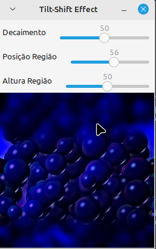

<script type="text/javascript" async
  src="https://cdn.jsdelivr.net/npm/mathjax@3/es5/tex-mml-chtml.js">
</script>

[Voltar para a página principal](../index.md)

# **Relatório Atividade 6: Tiltshift **

# Universidade Federal do Rio Grande do Norte

**Engenharia Mecatrônica**  
**Disciplina: Processamento Digital de Imagens**

**Aluno(a):** Pedro Arthur Oliveira dos Santos  
**Professor(a):** Agostinho Brito Junior  
**Data:** 5/11

## 1. Introdução

Uma das operações mais importantes ao se trabalhar com imagens bidimensionais é a convolução bidimensional, que tem inúmeras aplicações no campo do processamento digital de imagens, principalmente o de realizar uma filtragem, borramento ou detecção de bordas.
O efeito tiltshift pode ser observado quando borramos saturamos as cores ao redor de um ponto central de uma cena, assim produzindo um efeito visual de miniatura.

---

## 2. Objetivo

O Objetivo dessa atividade é explorar o uso da operação de borramento de uma imagem, junto com o efeito de saturação de cores para tentar reproduzir o efeito tiltshift e deixar um
vídeo em miniatura.

---

## 3. Metodologia

### Exercício 1:
Utilizando o programa exemplos/tiltshift.cpp como referência, implemente um programa tiltshift.cpp. Três ajustes deverão ser providos na tela da interface:

um ajuste para regular a altura da região central que entrará em foco;

um ajuste para regular a força de decaimento da região borrada;

um ajuste para regular a posição vertical do centro da região que entrará em foco. Finalizado o programa, a imagem produzida deverá ser salva em arquivo.


### Exercício 2: 
Utilizando o programa exemplos/tiltshift.cpp como referência, implemente um programa tiltshiftvideo.cpp. Tal programa deverá ser capaz de processar um arquivo de vídeo, produzir o efeito de tilt-shift nos quadros presentes e escrever o resultado em outro arquivo de vídeo. A ideia é criar um efeito de miniaturização de cenas.
Descarte quadros em uma taxa que julgar conveniente para evidenciar o efeito de stop motion, comum em vídeos desse tipo.aior que o correspondente na matriz de máximos. Para os pixels selecionados, copie para a imagem de saída os pixels coloridos da imagem capturada.

### Efeito Tiltshigt
O efeito tiltshift pode ser observado quando ponderamos uma imagem por uma certa função e sua versão borrada por outra, criando um efeito em torno de algum ponto, normalmente a origem.
Uma das funções de ponderação mais utilizadas são uma combinação linear de funções tangentes hiperbólicas, como

$$
\alpha (x) = \frac{1}{2}( tanh(\frac{x-l_1}{d} + tanh(\frac{x-l_2}{d})
$$

onde d é chamado de decaimento, que mede a força do decaimento ao longo da região da imagem borrada, e l_1 e l_2 são linhas cujo valor de $$\alpha$$ assume valor em torno de 0.5.
e a a imagem combinada com o efeito tiltshift é dada por uma combinação linear convexa entre a imagem e a imagem borrada, dada por

$$
f_{tiltshift}(x,y) = \alpha(x) f(x,y) + (1-\alpha)( f(x,y) \ast M(x,y) ) 
$$

onde M(x,y) é uma máscara de borramento genérica, e $$ \ast $$ denota a convolução ou filtragem pela máscara.

### Descartando Quadros
Para descartar quadros do vídeo, basta pegarmos quadro a cada 2 ou mais iterações, para dar a impressão de passagem de tempo ao vídeo.

---
### 3.1. Implementação


### Exercício 1:

*Código Iterativo

```

#include <opencv2/opencv.hpp>
#include <iostream>

// Variáveis para sliders (trackbars)
int alpha_slider = 50; // controla o decaimento
int region_slider = 50; // controla a posição da região focal
int height_slider = 50; // controla a altura da região focal

int alpha_slider_max = 100;
int region_slider_max = 100;
int height_slider_max = 100;

cv::Mat image, blurred, tiltshift_image;

// Função para calcular a máscara de ponderação usando tangente hiperbólica
cv::Mat calculateAlphaMask(int region_center, int height, int decay) {
    int rows = image.rows;
    int cols = image.cols;
    cv::Mat alpha_mask = cv::Mat(rows, cols, CV_32F);  // Único canal

    int l1 = region_center - height / 2;
    int l2 = region_center + height / 2;

    for (int y = 0; y < rows; y++) {
        float alpha_value = 0.5 * (std::tanh((y - l1) / (float)decay) - std::tanh((y - l2) / (float)decay));
        alpha_mask.row(y).setTo(alpha_value);
    }

    // A máscara permanece com 1 canal
    return alpha_mask;
}

// Função para aplicar o efeito tilt-shift
void applyTiltShift() {
    int region_center = (region_slider * image.rows) / region_slider_max;
    int height = (height_slider * image.rows) / height_slider_max;
    int decay = (alpha_slider * 20) / alpha_slider_max + 1;

    // Calcula o mapa de ponderação
    cv::Mat alpha_mask = calculateAlphaMask(region_center, height, decay);

    // Converte a máscara alpha para 3 canais
    cv::Mat alpha, inverted_alpha;
    cv::Mat alpha_rgb;
    cv::merge(std::vector<cv::Mat>{alpha_mask, alpha_mask, alpha_mask}, alpha_rgb);

    // Inverte a máscara para a região desfocada
    inverted_alpha = 1.0 - alpha_rgb;

    // Converte imagens para o tipo float
    cv::Mat image_float, blurred_float;
    image.convertTo(image_float, CV_32FC3, 1.0 / 255.0);

    // Aplica o filtro de média para criar a imagem borrada
    cv::Mat blurred_temp;
    int kernel_size = 15; // Tamanho do kernel do filtro de média
    cv::blur(image, blurred_temp, cv::Size(kernel_size, kernel_size));

    blurred_temp.convertTo(blurred_float, CV_32FC3, 1.0 / 255.0);

    // Multiplica as imagens pela máscara
    cv::Mat original_weighted, blurred_weighted;
    cv::multiply(image_float, alpha_rgb, original_weighted);
    cv::multiply(blurred_float, inverted_alpha, blurred_weighted);

    // Combina as imagens ponderadas
    cv::add(original_weighted, blurred_weighted, tiltshift_image);
    tiltshift_image.convertTo(tiltshift_image, CV_8UC3, 255.0);

    // Exibe a imagem resultante
    cv::imshow("Tilt-Shift Effect", tiltshift_image);
}

// Funções de callback para cada slider
void onAlphaChange(int, void*) {
    applyTiltShift();
}

void onRegionChange(int, void*) {
    applyTiltShift();
}

void onHeightChange(int, void*) {
    applyTiltShift();
}

int main(int argc, char** argv) {
    if (argc < 2) {
        std::cerr << "Uso: " << argv[0] << " <caminho_da_imagem>" << std::endl;
        return -1;
    }

    // Carrega a imagem de entrada
    image = cv::imread(argv[1]);
    if (image.empty()) {
        std::cerr << "Erro ao carregar a imagem." << std::endl;
        return -1;
    }

    // Aplica o filtro de média na imagem
    int kernel_size = 15; // Tamanho do kernel do filtro de média
    cv::blur(image, blurred, cv::Size(kernel_size, kernel_size));

    cv::namedWindow("Tilt-Shift Effect", cv::WINDOW_AUTOSIZE);

    // Cria os sliders para ajustar o valor de alpha, a posição da região e a altura da região
    cv::createTrackbar("Decaimento", "Tilt-Shift Effect", &alpha_slider, alpha_slider_max, onAlphaChange);
    cv::createTrackbar("Posição Região", "Tilt-Shift Effect", &region_slider, region_slider_max, onRegionChange);
    cv::createTrackbar("Altura Região", "Tilt-Shift Effect", &height_slider, height_slider_max, onHeightChange);

    // Aplica o efeito tilt-shift com os valores padrão dos sliders
    applyTiltShift();

    // Espera até que o usuário pressione uma tecla e então salva a imagem
    cv::waitKey(0);

    cv::imwrite("tiltshift_result.jpg", tiltshift_image);
    std::cout << "Imagem tilt-shift salva como 'tiltshift_result.jpg'" << std::endl;

    return 0;
}


```


### Exercício 2:
* Adaptando o código ```tiltshift.cpp``` para fazer isso para cada frame do vídeo e descartando o quadro, 

```


```

## 4. Resultados

### Exercício 1:
A figura mostra o resultado da implementação dos 3 sliders para controlar a região central de foco, foi observado que as cores foram alteradas e ocorreu saturação em algumas componentes de cor, alterando a cor da imagem, mas os sliders ajustaram corretamente os parâmetros.



*Figura 1: Resultado da visualização do primeiro código de tiltshift.*

### Exercício 2:


---

## 5. Conclusão
A operação de tiltshift é muito útil nas aplicações cinematográficas e produz efeitos curiosos, a maneira que os efeitos de borramento, saturação e redução de frames causam uma impressão cinematográfica é impressionante.

---

## 6. Referências

GONZALEZ, Rafael C.; WOODS, Richard E. **Processamento Digital de Imagens**. 3. ed. São Paulo: Pearson Prentice Hall, 2010.
