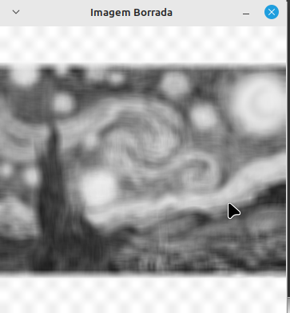

<script type="text/javascript" async
  src="https://cdn.jsdelivr.net/npm/mathjax@3/es5/tex-mml-chtml.js">
</script>

[Voltar para a página principal](../index.md)

# **Relatório Atividade 6: Tiltshift **

# Universidade Federal do Rio Grande do Norte

**Engenharia Mecatrônica**  
**Disciplina: Processamento Digital de Imagens**

**Aluno(a):** Pedro Arthur Oliveira dos Santos  
**Professor(a):** Agostinho Brito Junior  
**Data:** 5/11

## 1. Introdução

Uma das operações mais importantes ao se trabalhar com imagens bidimensionais é a convolução bidimensional, que tem inúmeras aplicações no campo do processamento digital de imagens, principalmente o de realizar uma filtragem, borramento ou detecção de bordas.
O efeito tiltshift pode ser observado quando borramos saturamos as cores ao redor de um ponto central de uma cena, assim produzindo um efeito visual de miniatura.

---

## 2. Objetivo

O Objetivo dessa atividade é explorar o uso da operação de borramento de uma imagem, junto com o efeito de saturação de cores para tentar reproduzir o efeito tiltshift e deixar um
vídeo em miniatura.

---

## 3. Metodologia

### Exercício 1:
Utilizando o programa exemplos/tiltshift.cpp como referência, implemente um programa tiltshift.cpp. Três ajustes deverão ser providos na tela da interface:

um ajuste para regular a altura da região central que entrará em foco;

um ajuste para regular a força de decaimento da região borrada;

um ajuste para regular a posição vertical do centro da região que entrará em foco. Finalizado o programa, a imagem produzida deverá ser salva em arquivo.

O efeito tiltshift pode ser observado quando ponderamos uma imagem por uma certa função e sua versão borrada por outra, criando um efeito em torno de algum ponto, normalmente a origem.
Uma das funções de ponderação mais utilizadas são uma combinação linear de funções tangentes hiperbólicas, como

$$
\alfa (x) = \frac{1}{2}( tanh(\frac{x-l_1}{d} + tanh(\frac{x-l_2}{d})
$$

onde d é chamado de decaimento, que mede a força do decaimento ao longo da região da imagem borrada, e l_1 e l_2 são linhas cujo valor de $$\alfa$$ assume valor em torno de 0.5.


### Exercício 2: 
Utilizando o programa exemplos/tiltshift.cpp como referência, implemente um programa tiltshiftvideo.cpp. Tal programa deverá ser capaz de processar um arquivo de vídeo, produzir o efeito de tilt-shift nos quadros presentes e escrever o resultado em outro arquivo de vídeo. A ideia é criar um efeito de miniaturização de cenas.
Descarte quadros em uma taxa que julgar conveniente para evidenciar o efeito de stop motion, comum em vídeos desse tipo.aior que o correspondente na matriz de máximos. Para os pixels selecionados, copie para a imagem de saída os pixels coloridos da imagem capturada.

Adaptando o código ```tiltshift.cpp``` para realizar a convoluçaõ com a máscara da aproximação do laplaciano, temos que 


---
### 3.1. Implementação


### Exercício 1:

*Código Iterativo

```

#include <iostream>
#include <opencv2/opencv.hpp>

int main() {
    cv::Mat image, image_32F, imagem_borrada;

    // Carrega a imagem em escala de cinza
    image = cv::imread("image.png", cv::IMREAD_GRAYSCALE);
    if (image.empty()) {
        std::cerr << "Erro ao carregar a imagem!" << std::endl;
        return -1;
    }

    image.convertTo(image_32F, CV_32F);
    int N = 3;  // Valor inicial da máscara (3x3)

    while (true) {
        int meio = (N - 1) / 2;

        // Cria uma máscara NxN com valores iguais e aplica o filtro
        cv::Mat mask = cv::Mat::ones(N, N, CV_32F) / (float)(N * N);
        cv::filter2D(image_32F, imagem_borrada, image_32F.depth(), mask, cv::Point(meio, meio), cv::BORDER_REPLICATE);

        // Converte para 8 bits para exibição
        cv::Mat imagem_borrada_8U;
        imagem_borrada.convertTo(imagem_borrada_8U, CV_8U);

        // Exibe o resultado
        cv::imshow("Imagem Borrada", imagem_borrada_8U);

        // Exibe o valor atual de N
        std::cout << "Dimensão da máscara: " << N << "x" << N << std::endl;

        // Espera por uma tecla
        int key = cv::waitKey();

        // Aumenta o tamanho da máscara ao pressionar a tecla "Seta para cima" e decrementa com "Seta para baixo"
        if (key == 27) // ESC para sair
            break;
        else if (key == 82) // Tecla "Seta para cima" (código 82)
            N += 2; // Aumenta N para o próximo ímpar
        else if (key == 84 && N > 3) // Tecla "Seta para baixo" (código 84)
            N -= 2; // Diminui N para o ímpar anterior

        // Limpa a janela
        cv::destroyWindow("Imagem Borrada");
    }

    return 0;
}


```


### Exercício 2:
* Código Implementado

```

#include <iostream>
#include <opencv2/opencv.hpp>
#include "camera.hpp"

int main(int, char **) {
  cv::VideoCapture cap;
  
  float laplacian[] = {0, -1, 0, -1, 4, -1, 0, -1, 0};

  cv::Mat frame, frame32f, laplaciano;
  cv::Mat mask(3, 3, CV_32F);
  cv::Mat f_max;
  double width, height;
  int counter;

  cap.open(argv[1]);
  if(!cap.isOpened())
  return -1;

  width=cap.get(cv::CAP_PROP_FRAME_WIDTH);
  height=cap.get(cv::CAP_PROP_FRAME_HEIGHT);
  std::cout << "largura=" << width << "\n";
  std::cout << "altura =" << height<< "\n";
  
  cv::Size frameSize(static_cast<int>(width), static_cast<int>(height));
  
  mask = cv::Mat(3, 3, CV_32F, laplacian);
 
  max_laplacian = cv::Mat::zeros(frameSize, CV_32F;
  f_max = cv::Mat::zeros(frameSize, CV_32F);
  
  for(counter=0; cap.read(frame); counter++){

    frame.convertTo(frame32f, CV_32F);
    cv::filter2D(frame32f, laplaciano , frame32f.depth(), mask, cv::Point(1, 1), cv::BORDER_REPLICATE);
    for( int i = 0; i <height; i++){
        for (int j = 0; j < width; j++){
            if  laplaciano.at<uchar>(i,j) >= max_laplacian.at<uchar>(i,j){
                max_laplacian.at<uchar>(i,j) = laplaciano.at<uchar>(i,j);
                f_max.at<uchar>(i,j) = frame32f.at<uchar>(i,j);
            }
        }
    }
    
  }
  
  cv::imshow("janela", f_max);
  cv::imwrite("Imagem Realçada.png", f_max);
  cv::waitKey();
  
  
  return 0;
}

```

## 4. Resultados

### Exercício 1:
Foi possível observar, como na imagem abaixo, que quanto maior o valor do número de pixel N, maior o borramento, como mostram as imagens abaixo


*Figura 1: Imagem borrada com máscara 3x3.*




*Figura 1: Imagem borrada com máscara 11x11.*


*Figura 1: Imagem borrada com máscara 21x21.*


### Exercício 2: 


---

## 5. Conclusão


---

## 6. Referências

GONZALEZ, Rafael C.; WOODS, Richard E. **Processamento Digital de Imagens**. 3. ed. São Paulo: Pearson Prentice Hall, 2010.
