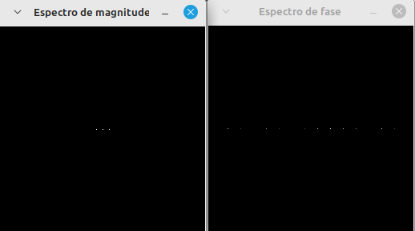
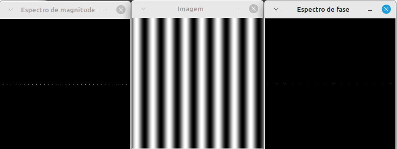

<script type="text/javascript" async
  src="https://cdn.jsdelivr.net/npm/mathjax@3/es5/tex-mml-chtml.js">
</script>

[Voltar para a página principal](../index.md)

#**Relatório Atividade 8: Transformada de Fourier**

# Universidade Federal do Rio Grande do Norte

**Engenharia Mecatrônica**  
**Disciplina: Processamento Digital de Imagens**

**Aluno(a):** Pedro Arthur Oliveira dos Santos  
**Professor(a):** Agostinho Brito Junior  
**Data:** 25/11

## 1. Introdução

A transformada de fourier é uma ferramente muito utilizada em muitas áreas de engenharia, principalmente na área de processamento de sinais, onde se trabalham com sinais conhecidos como 
sinais periódicos, que seguem ciclos e se repetem.
No processamento digital de imagens ela também é uma ferramenta fundamental, utilizada para transformar a imagem de um domínio especial para um domínio de frequências bidimensionais.

---

## 2. Objetivo


O Objetivo dessa atividade é trabalhar como é feito o cálculo da transformada de fourier sobre uma imagem e quais os passos necessários para a exibição e manipulação.

---


## 3. Metodologia

### Imagens como Funções bidimensionais
Uma imagem em escala cinza é definida como uma função de duas variáveis que recebe uma posição, que é composta por uma linha(x) e uma coluna(y), e retorna o valor de intensidade de brilho nessa
mesma região, e pode ser representada como

$$
z = f(x, y)
$$
onde comumente z é um número entre 0 e 255, que são os números de bits(8) necessários para representar 256 valores.


### Função Imagem Senoidal
Uma função senoidal pode definir uma imagem periódica, especificamente, podemos ter uma função senoidal nas linhas ou nas colunas, definindo

$$
z = f(x, y) = Asen(\frac{2 \pi f x}{M}) + D
$$

ou uma função senoidal periódica nas colunas

$$
z = f(x, y) = Asen(\frac{2 \pi f y}{N}) + D
$$

onde M e N são os números de linhas e colunas, respectivamente.

### Transformada de fourier bidimensional
A transformada de fourier sobre uma imagem é definida como uma integral dupla sobre o círculo unitário, dada por

$$
F(u,v) = \int_{-\infty}^{\infty} \int_{-\infty}^{\infty} f(x,y)e^{-j 2 \pi (ux+vy)} dx dy
$$

porém as imagens são discretas, e uma aproximação discretizada da expressão acima pode ser obtida, adimitindo a imagem como uma soma de um trem de impulsos contínuos de duas variáveis, tem-se

$$
f(x = iT_m, y = nT_n) = \overline{f}(x, y) = \sum_{i}^{} \sum_{n}^{} f(x,y)\cdot \delta(x - iT_m) \delta(y - nT_n)
$$

considerando um período constante e uniforme para as amostras da imagem, temos 

$$
T_m = 1/M
$$

e

$$
T_n = 1/N
$$

e ainda simplificando a expressão temos

$$
\overline{f}(x, y) = f(x,y) \sum_{i}^{} \sum_{n}^{} \delta(x - iT_m) \delta(y - nT_n)
$$

substituindo agora essa função na expressão da transformada de fourier temos

$$
F(u,v) = \int_{-\infty}^{\infty} \int_{-\infty}^{\infty} \sum_{i}^{} \sum_{n}^{} f(x,y) \delta(x - iT_m) \delta(y - nT_n) e^{-j 2 \pi (ux+vy)} dx dy
$$

podemos rearranjar agora a integral e os somatórios, e a expressão acima se torna

$$
F(u,v) = \int_{-\infty}^{\infty} \sum_{n}^{} \delta(y - nT_n)  \sum_{i}^{} \int_{-\infty}^{\infty} f(x,y) \delta(x - iT_m) e^{-j 2 \pi ux} dx e^{-j 2 \pi vy} dy
$$

e a integral interna pode ser resolvida utilizando a noção de integrais com impulsos, e é dada por 

$$
\int_{-\infty}^{\infty} f(x,y) \delta(x - iT_m) e^{-j 2 \pi ux} dx = f(iT_m,y) e^{- j 2 \pi uiT_m}
$$

assim ficamos com 

$$
F(u,v) = \int_{-\infty}^{\infty} \sum_{n}^{} \delta(y - nT_n)  \sum_{i}^{} f(iT_m,y) e^{-j 2 \pi uiT_m}  e^{-j 2 \pi vy}dy
$$

agora reorganizando mais uma vez e trocando a ordem do somatório com a integral

$$
F(u,v) = \sum_{i}^{} e^{-j 2 \pi uiT_m}  \sum_{n}^{}  \int_{-\infty}^{\infty} f(iT_m,y) \delta(y - nT_m) e^{-j 2 \pi vy}dy
$$

e utilizando denovo o conceito de integrais com impulso, finalmente temos

$$
F(u,v) = \sum_{i}^{} e^{-2 \pi uiT_m}  \sum_{n}^{}  f(iT_m,nT_n) e^{-j 2 \pi v\frac{n}{N}} = \sum_{i}^{} \sum_{n}^{} f(iT_m,nT_n) e^{-j 2 \pi (uiT_m + vnT_n)}
$$

e a expressão final normalizada se torna

$$
F(u,v) = \frac{1}{M} \frac{1}{N} \sum_{i}^{} \sum_{n}^{} f[i,n] e^{-j 2 \pi (u\frac{i}{M} + v\frac{n}{N})}
$$

que é conhecida como a transformada discreta de fourier bidimensional.


### 3.1. Implementação

#### Questão 1: Transformada de fourier de uma senoide
Foi então utilizado o código do professor como referência para as operações computacionais com a DFT, tendo toda a preparação da imagem para tal, e assim com as devidas alterações o código ficou 

* Código

```
#include <iostream>
#include <opencv2/opencv.hpp>
#include <vector>

void swapQuadrants(cv::Mat& image) {
  cv::Mat tmp, A, B, C, D;

  // se a imagem tiver tamanho impar, recorta a regiao para o maior
  // tamanho par possivel (-2 = 1111...1110)
  image = image(cv::Rect(0, 0, image.cols & -2, image.rows & -2));

  int centerX = image.cols / 2;
  int centerY = image.rows / 2;

  // rearranja os quadrantes da transformada de Fourier de forma que
  // a origem fique no centro da imagem
  // A B   ->  D C
  // C D       B A
  A = image(cv::Rect(0, 0, centerX, centerY));
  B = image(cv::Rect(centerX, 0, centerX, centerY));
  C = image(cv::Rect(0, centerY, centerX, centerY));
  D = image(cv::Rect(centerX, centerY, centerX, centerY));

  // swap quadrants (Top-Left with Bottom-Right)
  A.copyTo(tmp);
  D.copyTo(A);
  tmp.copyTo(D);

  // swap quadrant (Top-Right with Bottom-Left)
  C.copyTo(tmp);
  B.copyTo(C);
  tmp.copyTo(B);
}

int main(int argc, char** argv) {
  cv::Mat image, padded, complexImage;
  std::vector<cv::Mat> planos;

  image = imread(argv[1], cv::IMREAD_GRAYSCALE);
  if (image.empty()) {
    std::cout << "Erro abrindo imagem" << argv[1] << std::endl;
    return EXIT_FAILURE;
  }

  // expande a imagem de entrada para o melhor tamanho no qual a DFT pode ser
  // executada, preenchendo com zeros a lateral inferior direita.
  int dft_M = cv::getOptimalDFTSize(image.rows);
  int dft_N = cv::getOptimalDFTSize(image.cols);
  cv::copyMakeBorder(image, padded, 0, dft_M - image.rows, 0,
                     dft_N - image.cols, cv::BORDER_CONSTANT,
                     cv::Scalar::all(0));

  // prepara a matriz complexa para ser preenchida
  // primeiro a parte real, contendo a imagem de entrada
  planos.push_back(cv::Mat_<float>(padded));
  // depois a parte imaginaria com valores nulos
  planos.push_back(cv::Mat::zeros(padded.size(), CV_32F));

  // combina os planos em uma unica estrutura de dados complexa
  cv::merge(planos, complexImage);

  // calcula a DFT
  cv::dft(complexImage, complexImage);
  swapQuadrants(complexImage);

  // planos[0] : Re(DFT(image)
  // planos[1] : Im(DFT(image)
  cv::split(complexImage, planos);

  // calcula o espectro de magnitude e de fase (em radianos)
  cv::Mat magn, fase;
  cv::cartToPolar(planos[0], planos[1], magn, fase, false);
  cv::normalize(fase, fase, 0, 1, cv::NORM_MINMAX);

  // caso deseje apenas o espectro de magnitude da DFT, use:
  cv::magnitude(planos[0], planos[1], magn);

  // some uma constante para evitar log(0)
  // log(1 + sqrt(Re(DFT(image))^2 + Im(DFT(image))^2))
  magn += cv::Scalar::all(1);

  // calcula o logaritmo da magnitude para exibir
  // com compressao de faixa dinamica
  cv::log(magn, magn);
  cv::normalize(magn, magn, 0, 1, cv::NORM_MINMAX);

  // exibe as imagens processadas
  cv::imshow("Imagem", image);
  cv::imshow("Espectro de magnitude", magn);
  cv::imshow("Espectro de fase", fase);

  cv::waitKey();
  return EXIT_SUCCESS;
}


```

#### Questão 2: Transformada de fourier de uma senoide em ponto flutuante(melhor aproximação)
Foi então utilizado o código do professor como referência para as operações computacionais com a DFT, tendo toda a preparação da imagem para tal, e assim com as devidas alterações o código ficou 

* Código

```

  
```


## 4. Resultados

### Exibição da transformada de fourier 
Percebeu-se que ao contrário do exemplo feito pelo professor, a imagem aqui requisitada era periódica nas linhas, pois dependia da i-ésima linha x (i), e seu espectro esperado teoricamente calculado pela transformada de fourier é um trem de impulsos, assim como na transformada de fourier bidimensional

$$
F(u,v) = \int_{-\infty}^{\infty} \int_{-\infty}^{\infty} f(x,y)e^{-2 \pi j(ux+vy)} dx dy = \int_{-\infty}^{\infty} \int_{-\infty}^{\infty} Asen(2 \pi f x) e^{-j 2 \pi (ux+vy)} dx dy
$$

calculando a integral, temos

$$
F(u,v) = A \int_{-\infty}^{\infty} \int_{-\infty}^{\infty} sen(2 \pi f x) e^{-j 2 \pi (ux+vy)} dx dy
$$

utilizando a identidade de euler, 

$$
sen(2 \pi f x) = \frac{e^{j 2 \pi f x} - e^{-j 2 \pi f x}}{2j}
$$

substituindo agora na expressão da transformada de fourier

$$
F(u,v) = \frac{A}{2j} \int_{-\infty}^{\infty} \int_{-\infty}^{\infty} (e^{j 2 \pi f x} - e^{-j 2 \pi f x}) e^{-2 \pi (ux+vy)} dx dy
$$

separando a soma, temos

$$
F(u,v) = \frac{A}{2j} \int_{-\infty}^{\infty} \int_{-\infty}^{\infty} e^{j 2 \pi f x} e^{-j 2 \pi (ux+vy)} dx dy  - \frac{A}{2} \int_{-\infty}^{\infty} \int_{-\infty}^{\infty} e^{-j 2 \pi f x} e^{-j 2 \pi (ux+vy)} dx dy
$$

Somando os expoentes das exponenciais, temos

$$
F(u,v) = \frac{A}{2j} \int_{-\infty}^{\infty} \int_{-\infty}^{\infty} e^{j 2 \pi f x - j 2 \pi (ux+vy)} dx dy - \frac{A}{2} \int_{-\infty}^{\infty} \int_{-\infty}^{\infty} e^{-j 2 \pi f x -j 2 \pi (ux+vy)} dx dy
$$

colocando o x em evidência nas exponenciais

$$
F(u,v) = \frac{A}{2j} \int_{-\infty}^{\infty} \int_{-\infty}^{\infty} e^{j 2 \pi (f - u)x - j 2\pi vy} dx dy - \frac{A}{2} \int_{-\infty}^{\infty} \int_{-\infty}^{\infty} e^{-j 2 \pi (f + u)x - j 2 \pi vy } dx dy
$$

Agora podemos integrar 

$$
\int_{-\infty}^{\infty} e^{j 2 \pi (f - u)x - j 2 \pi vy} dx  = \left[ \frac{e^{j 2 \pi (f - u)x - j 2 \pi vy}}{j 2 \pi (f - u)} \right]_{x = -\infty}^{x = \infty}
$$

e o segundo termo da soma

$$
\int_{-\infty}^{\infty} e^{-j 2 \pi (f + u)x - j 2 \pi vy } dx = \left[ \frac{e^{-j 2 \pi (f + u)x - j 2 \pi vy}}{-j 2 \pi (f + u)} \right]_{x = -\infty}^{x = \infty}
$$

Aplicando os limites para a integral imprópria

$$
e^{-j 2 \pi vy } (\lim_{x \to \infty} \frac{e^{j 2 \pi (f - u)x }}{j 2 \pi (f - u)} - \lim_{x \to -\infty} \frac{e^{j 2 \pi (f - u)x }}{j 2 \pi (f - u)} )
$$

e

$$
e^{-j 2\pi vy } (\lim_{x \to \infty} \frac{e^{j 2 \pi (f + u)x }}{-j 2 \pi (f + u)} - \lim_{x \to -\infty} \frac{e^{j 2 \pi (f + u)x }}{-j 2 \pi (f + u)} )
$$

podemos agora somar os dois termos

$$
e^{-j 2\pi vy } ( \lim_{x \to \infty} \frac{e^{j 2 \pi (f - u)x }}{2 \pi (f - u)} - \lim_{x \to -\infty} \frac{e^{j 2 \pi (f - u)x }}{2 \pi (f - u)} - \lim_{x \to \infty} \frac{e^{j 2 \pi (f + u)x }}{j 2 \pi (f + u)} - \lim_{x \to -\infty} \frac{e^{j 2 \pi (f + u)x }}{2 \pi (f + u)} )
$$

agora analisando os termos da soma, vemos que as duas parcelas convergem para funções sinc's

$$
\lim_{x \to \infty} \frac{e^{j 2 \pi (f - u)x }}{j 2 \pi (f - u)} - \lim_{x \to -\infty} \frac{e^{j 2 \pi (f - u)x }}{j 2 \pi (f - u)} = \lim_{x \to \infty} \frac{e^{j 2 \pi (f - u)x} - e^{- j 2 \pi (f - u)x }}{j 2 \pi (f - u)}  = \lim_{x \to \infty} \frac{\sin(2 \pi (f - u) x)}{\pi (f-u)}
$$

e

$$
\lim_{x \to -\infty} \frac{e^{-j 2 \pi (f + u)x }}{-j 2 \pi (f + u)}  - \lim_{x \to \infty} \frac{e^{-j 2 \pi (f + u)x }}{-j 2 \pi (f + u)} = \lim_{x \to \infty} \frac{e^{-j 2 \pi (f + u)x} - e^{j 2 \pi (f + u)x }}{j 2 \pi (f + u)}  = \lim_{x \to \infty} -\frac{\sin(2 \pi (f + u) x)}{\pi (f+u)}
$$

e esses dois limites são conhecidos por resultarem em funções impulsos

$$
\lim_{x \to \infty} -\frac{sin(2 \pi (f + u) x}{ \pi (f+u)} = -\delta (f+u)
$$

e

$$
\lim_{x \to \infty} \frac{sin(2 \pi (f - u) x}{ \pi (f-u)} = \delta (f-u)
$$

agora substituindo de volta na integral temos


$$
F(u,v) = \frac{A}{2j} \int_{-\infty}^{\infty} (\delta (f-u)-\delta (f+u)) e^{-j 2\pi vy } dy
$$

agora as funções de u podem sair da integral, e temos

$$
F(u,v) = \frac{A}{2j}(\delta (f-u)-\delta (f+u))\int_{-\infty}^{\infty} e^{-j 2\pi vy } dy = \frac{A}{2j}(\delta (f-u)-\delta (f+u)) \left[ \frac{e^{-j 2 \pi vy}}{-j 2 \pi v} \right]_{y = -\infty}^{y = \infty}
$$

aplicando o limite, chegamos que

$$
\left[ \frac{e^{-j 2 \pi vy}}{-j 2 \pi v} \right]_{y = -\infty}^{y = \infty} = \lim_{y \to \infty} \frac{e^{-j 2 \pi vy }}{-j 2 \pi v} - \lim_{y \to -\infty} \frac{e^{-j 2 \pi vy }}{-j 2 \pi v}
$$

podemos verificar mais uma vez que converge para uma sinc, e uma sinc com argumento tendendo ao infinito tende a um impulso, sendo assim

$$
\lim_{y \to \infty} \frac{e^{-j 2 \pi vy }}{-j 2 \pi v} - \lim_{y \to -\infty} \frac{e^{-j 2 \pi vy }}{-j 2 \pi v} = \lim_{y \to \infty} \frac{e^{j 2 \pi vy } - e^{-j 2 \pi vy }}{j 2 \pi v} = \lim_{y \to \infty} \frac{sin(2\pi vy)}{\pi v} = 2 \delta (v)
$$

agora substituindo de volta na integral por fim

$$
F(u,v) = \frac{A}{2j} (\delta (f-u)-\delta (f+u)) \int_{-\infty}^{\infty}  e^{-j 2\pi vy } dy =  \frac{A}{2j} (\delta (f-u)-\delta (f+u)) \cdot 2 \delta (v) 
$$

e por fim

$$
F(u,v) = jA \delta (f+u) \delta (v) - jA \delta(f-u) \delta(v)
$$

Agora calculando o módulo

$$
|F(u,v)| = |jA (\delta (f+u) \delta (v) - \delta(f-u) \delta(v))| = |A| |\delta (f+u) \delta (v) - \delta(f-u) \delta(v)| = |A|\delta (f+u) \delta (v)  +  |A|\delta (f-u) \delta (v) 
$$

ou seja, a transformada de uma senoide pode ser vista como dois pontos, um na frequência (u,v) = (u,0) e um na frequência (-u,0), além do ponto da origem
, ou seja, são três pontos, como mostra a figura abaixo


*Figura 1: Resultado da transformada de fourier teórica calculada analiticamente.*



*Figura 2: Resultado da transformada discreta de fourier utilizando os pixels em uchar.*


---

## 5. Conclusão

A manipulação e a serialização de dados é muito importante no processamento digital de imagens e nos pode dar uma noção das possíveis manipulações e formatos que podemos definir para uma imagem, e a implementação da imagem como uma função de duas variáveis também é capaz de nos dar uma melhor intuição ao trabalhar com imagens como se fosse funções de duas variáveis.

---

## 6. Referências

GONZALEZ, Rafael C.; WOODS, Richard E. **Processamento Digital de Imagens**. 3. ed. São Paulo: Pearson Prentice Hall, 2010.
