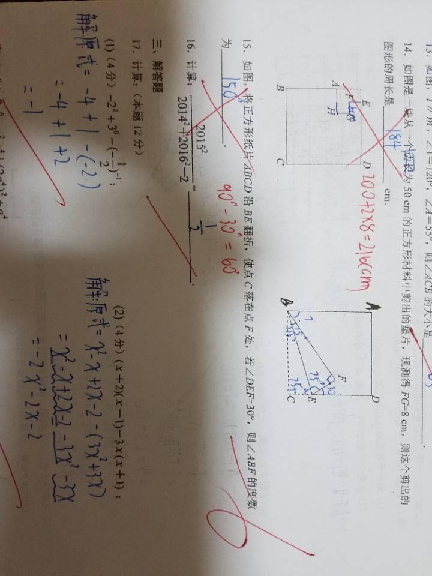
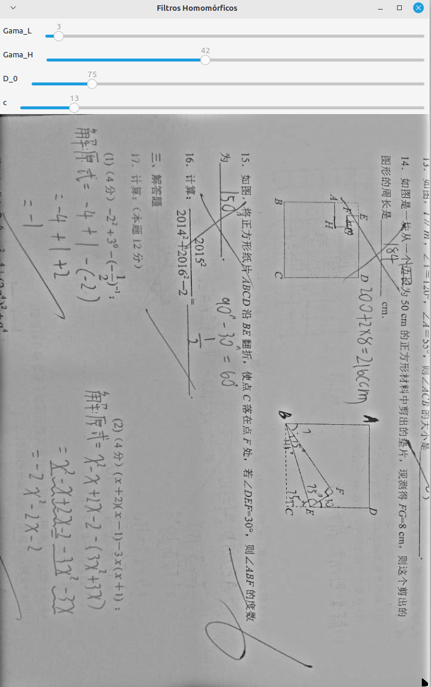

<script type="text/javascript" async
  src="https://cdn.jsdelivr.net/npm/mathjax@3/es5/tex-mml-chtml.js">
</script>

[Voltar para a página principal](../index.md)

#**Relatório Atividade 9: Filtragem Homomórfica no domínio da frequência**

# Universidade Federal do Rio Grande do Norte

**Engenharia Mecatrônica**  
**Disciplina: Processamento Digital de Imagens**

**Aluno(a):** Pedro Arthur Oliveira dos Santos  
**Professor(a):** Agostinho Brito Junior  
**Data:** 29/11

## 1. Introdução

Na aquisição de imagens é muito difícil ter uma aquisição ideal, principalmente por limitação de dispositivos e também pela má iluminação de uma cena.
Para isso, existe um filtro capaz de corrigir a iluminação de uma cena utilizando ferramentas matemáticas e algumas aproximações.

---

## 2. Objetivo

O Objetivo dessa atividade é utilizar ferramentas matemáticas como a transformada de fourier e operações como logaritmo, para realizar a filtragem de uma imagem afim de corrigir
sua iluminação.

---


## 3. Metodologia

### Componentes de uma imagem
O modelo matemático mais simples para fazer a descrição de imagens é o que utiliza os conceitos de iluminação e reflectância, 
podemos dizer que uma imagem é dada pelo produto

$$
f(x,y) = i(x,y) \cdot r(x,y)
$$

onde i e r são a iluminação e a reflectância, respectivamente.
e podemos inferir que a componente de iluminação, que representa a luz da cena, é uma componente que varia suavemente(frequências baixas), enquanto a componente da reflectância
tem frequências mais altas.
Com isso é foi desenvolvida uma estratégia para separar os sinais de alta e baixa frequência em uma soma, e então podemos aplicar um filtro passa-baixas para filtrar a imagem.

### Cepstrum complexo
O cepstrum complexo é um domínio aonde levamos nossa imagem, a viagem até esse domínio tem como ponto final de passagem o domínio da frequência ja conhecido que somos levados pela transformada de fourier, depois basta pegarmos o logaritmo desse resultado e teremos nossos sinais separados, teoricamente.
Esse processo pode ser descrito matematicamente como

$$
Ln( f(x,y) = i(x,y) \cdot r(x,y) ) => z(x,y) = Ln(i(x,y)) + Ln(r(x,y))
$$

aplicando agora a transformada de fourier

$$
Z(u,v) = FFT ( Ln(i(x,y)) + Ln(r(x,y)) ) = FFT(Ln(i(x,y))) + FFT(Ln(r(x,y)))
$$

### Filtro homomórfico
Por fim aplicamos o filtro à imagem $$Z(u,v)$$

$$
S(u,v) = H(u,v) \cdot Z(u,v)
$$

onde H(u,v) é o filtro homomórfico, dado matematicamente por

$$
H(u,v) = \gamma_L + (\gamma_H - \gamma_L)(1 - e^{-c\frac{D(u,v)^2}{D_0^2} })
$$

e então para obter de volta a imagem, basta fazermos

$$
s(x,y) = IFFT(S(u,v))
$$

e finalmente

$$
f_{filtrada}(x,y) = exp(s(x,y))
$$

computacionalmente o filtro pode ser implementado como um laço for duplo, como é mostrado na função abaixo

```
/ Cria o filtro homomórfico
void HomoFilter(const cv::Mat& image, cv::Mat& filter) {
    cv::Mat_<float> filter2D(image.rows, image.cols);
    int centerX = image.cols / 2;
    int centerY = image.rows / 2;

    for (int i = 0; i < image.rows; i++) {
        for (int j = 0; j < image.cols; j++) {
            float D = sqrt(pow(i - centerY, 2) + pow(j - centerX, 2));
            filter2D.at<float>(i, j) = gama_L + (gama_H - gama_L) * (1 - exp(-c * pow(D, 2) / pow(D_0, 2)));
        }
    }

    cv::Mat planes[] = {filter2D, cv::Mat::zeros(filter2D.size(), CV_32F)};
    cv::merge(planes, 2, filter);
}
```

foi então adquirida uma cena com má iluminação, que é a imagem mostrada abaixo em tons



*Figura 1: Imagem que será aplicada o filtro homomórfico para corrigir iluminação.*


### 3.1. Implementação do filtro homomórfico
Foi então utilizado o código do professor como referência para as operações computacionais com a DFT e aplicação da função de filtro, e foi feito uma função para aplicar o filtro homomórfico. 

* Código 

```
#include <iostream>
#include <opencv2/opencv.hpp>
#include <cmath>

int gama_L = 1;
int gama_H = 2;
int D_0 = 5;
int c = 1;

cv::Mat originalImage, paddedImage, resultImage;

// Troca os quadrantes da transformada de Fourier
void swapQuadrants(cv::Mat& image) {
    cv::Mat tmp, A, B, C, D;

    image = image(cv::Rect(0, 0, image.cols & -2, image.rows & -2));

    int centerX = image.cols / 2;
    int centerY = image.rows / 2;

    A = image(cv::Rect(0, 0, centerX, centerY));
    B = image(cv::Rect(centerX, 0, centerX, centerY));
    C = image(cv::Rect(0, centerY, centerX, centerY));
    D = image(cv::Rect(centerX, centerY, centerX, centerY));

    A.copyTo(tmp);
    D.copyTo(A);
    tmp.copyTo(D);

    C.copyTo(tmp);
    B.copyTo(C);
    tmp.copyTo(B);
}

// Cria o filtro homomórfico
void HomoFilter(const cv::Mat& image, cv::Mat& filter) {
    cv::Mat_<float> filter2D(image.rows, image.cols);
    int centerX = image.cols / 2;
    int centerY = image.rows / 2;

    for (int i = 0; i < image.rows; i++) {
        for (int j = 0; j < image.cols; j++) {
            float D = sqrt(pow(i - centerY, 2) + pow(j - centerX, 2));
            filter2D.at<float>(i, j) = gama_L + (gama_H - gama_L) * (1 - exp(-c * pow(D, 2) / pow(D_0, 2)));
        }
    }

    cv::Mat planes[] = {filter2D, cv::Mat::zeros(filter2D.size(), CV_32F)};
    cv::merge(planes, 2, filter);
}

// Função callback dos trackbars
void onTrackbarChange(int, void*) {
    cv::Mat complexImage;
    std::vector<cv::Mat> planos;

    // Prepara a matriz complexa
    planos.clear();
    planos.push_back(cv::Mat_<float>(paddedImage));
    planos.push_back(cv::Mat::zeros(paddedImage.size(), CV_32F));
    cv::merge(planos, complexImage);

    // Calcula a DFT
    cv::dft(complexImage, complexImage);
    swapQuadrants(complexImage);

    // Cria e aplica o filtro
    cv::Mat filter;
    HomoFilter(complexImage, filter);
    cv::mulSpectrums(complexImage, filter, complexImage, 0);

    // Calcula a DFT inversa
    swapQuadrants(complexImage);
    cv::idft(complexImage, complexImage);
    cv::split(complexImage, planos);

    // Recorta a imagem para o tamanho original
    cv::Rect roi(0, 0, originalImage.cols, originalImage.rows);
    resultImage = planos[0](roi);

    // Normaliza para exibição
    cv::normalize(resultImage, resultImage, 0, 1, cv::NORM_MINMAX);
    cv::imshow("Filtros Homomórficos", resultImage);
}

int main(int argc, char** argv) {
    originalImage = cv::imread(argv[1], cv::IMREAD_GRAYSCALE);
    if (originalImage.empty()) {
        std::cerr << "Erro ao abrir a imagem: " << argv[1] << std::endl;
        return EXIT_FAILURE;
    }

    // Expande a imagem para o melhor tamanho para DFT
    int dft_M = cv::getOptimalDFTSize(originalImage.rows);
    int dft_N = cv::getOptimalDFTSize(originalImage.cols);
    cv::copyMakeBorder(originalImage, paddedImage, 0, dft_M - originalImage.rows, 0, dft_N - originalImage.cols, cv::BORDER_CONSTANT, cv::Scalar::all(0));

    // Cria a janela e os trackbars
    cv::namedWindow("Filtros Homomórficos", cv::WINDOW_NORMAL);
    cv::createTrackbar("Gama_L", "Filtros Homomórficos", &gama_L, 100, onTrackbarChange);
    cv::createTrackbar("Gama_H", "Filtros Homomórficos", &gama_H, 100, onTrackbarChange);
    cv::createTrackbar("D_0", "Filtros Homomórficos", &D_0, 500, onTrackbarChange);
    cv::createTrackbar("c", "Filtros Homomórficos", &c, 100, onTrackbarChange);

    // Atualiza a imagem inicialmente
    onTrackbarChange(0, nullptr);
    cv::waitKey(0);

    return EXIT_SUCCESS;
}


```


## 4. Resultados

### Resultado da filtragem homomórfica no domínio da frequência
O filtro foi aplicado à imagem feita as devidas preparações necessárias, os parâmetros do filtros usados foram

Treshold inferior
$$
\gamma_L = 3
$$

Treshold superior
$$
\gamma_H = 42
$$

Frequência/raio de corte
$$
D_0 = 75
$$

fator de atenuação 
$$
c = 13
$$

e a imagem obtida é mostrada abaixo



*Figura 2: Resultado da Filtragem homomórfica para corrigir iluminação.*

---

## 5. Conclusão

A Filtragem homomórfica pode ser muito útil, por mais que ela não seja igual as outras filtragens no domínio da frequência, que focam mais em ruídos periódicos, sua aplicação pode ser também muito usada em muitas áreas do processamento de imagens principalmente para corrigir a iluminação de cenas.

---

## 6. Referências

GONZALEZ, Rafael C.; WOODS, Richard E. **Processamento Digital de Imagens**. 3. ed. São Paulo: Pearson Prentice Hall, 2010.
